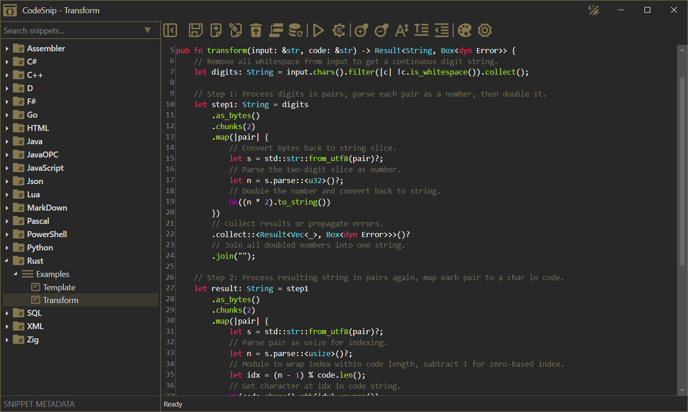

# CodeSnip (Avalonia)

**CodeSnip** — a snippet manager & local code runner with multi-language interpreter support and Compiler Explorer integration.

This project is a cross-platform port of the original **[CodeSnip (WPF) application](https://github.com/mx7b7/codesnip-wpf)** to the UI framework **[Avalonia](https://github.com/AvaloniaUI/Avalonia)**.


## ⬇️ Download

[](https://github.com/mx7b7/codesnip-avalonia/releases/latest)

---

## 🖼️ Preview



---

## ✨ Features

- **Local storage with SQLite**  
  All snippets are stored privately on your device.

- **Snippet organization**
  - Hierarchical: *Language → Category → Snippet* (TreeView)
  - Filter by name or tags
  - Instant search

- **AvaloniaEdit integration**
  - Syntax highlighting (light/dark mode)
  - Toggle single-line and multi-line comments

- **Highlighting Editor**
  - **Dual-Mode Editing**: Tabbed interface for both visual tweaks (colors, font styles) and advanced source code editing.
  - **Direct XSHD Source Editing**: Edit raw `.xshd` XML for full control over rules, spans, and keywords.
  - **Preview on Demand**: Apply changes from the XSHD source to the main editor before saving.
  - **Validation**: Integrated validation engine checks for XML errors and XSHD schema compliance.

- **Compiler Explorer (Godbolt) integration**:
  - Compile snippets without installing compilers locally
  - Support for 30+ languages
  - Add or edit available compilers
  - Select compiler and flags
  - View stdout/stderr output
  - **View assembly output** with syntax highlighting for supported languages
  - Generate shareable shortlinks to Compiler Explorer
  
 - **Local Code Execution**
  - Run scripts using built‑in support for Shell scripts (.sh), C#, F#, PowerShell, Python, PHP, Perl, Lua, Ruby, Node.js, and Java (via `JShell`) directly using local interpreters.
  - > **Note:** If an interpreter is not in your system's PATH, you can place its portable executable (e.g., `lua`, `node`, `csrunner`, `fsrunner`) in the `Tools/Interpreters` directory within the application's installation folder.
  - For C# and F# execution, you can use these custom wrappers:  
    - **C#**: [`csrunner`](https://gist.github.com/mx7b7/90013b77c1d0bcfb6b9e77399f62e409)  
    - **F#**: [`fsrunner`](https://gist.github.com/mx7b7/3d6ee8179ba435c2c1e1e19ee38dced9) or [`fsrunner-alt`](https://gist.github.com/mx7b7/1ca60b7e4f29b4220eeccda06f5ffc57)  
    - > These wrappers are provided as Gists for convenience, as building for all platforms is not feasible.

- **UI/UX**:
  - Responsive interface using Avalonia's SimpleTheme
  - Flyout panels for additional windows (settings, editors, actions, etc.)
  - Automatic loading of theme and syntax definitions
  
- **Export & Sharing**:
  - **Copy As**: Copy selected code as Markdown, HTML, BBCode, Base64, or JSON string.
  - **Export to File**: Save snippets in their original language format.
---

## 🧩 Supported Syntax Engines

| Engine | Status | Language Coverage |
|--------|--------|-------------------|
| **XSHD (AvaloniaEdit)** | Built‑in | 36+ bundled definitions (light/dark variants included); unlimited via custom `.xshd` files |
| **TextMateSharp** | Planned | 160+ grammars supported via `.tmLanguage` / `.plist` |
| **User‑Provided Definitions** | Supported | Unlimited — users can add any language manually |

---

## 🚧 Planned Features

The following features are planned for future releases:

- **Dynamic Accent Color**  
  Ability to change the application's accent color at runtime, with the selected color loaded automatically on startup.

- **Dual-Mode Syntax Highlighting**  
  Support for both native XSHD and TextMateSharp tokenizers in AvaloniaEdit. Users will be able to choose their preferred syntax highlighting engine in settings.  
  > Currently, only XSHD is implemented due to its superior performance.

## 📦 Libraries

This project uses the following open-source libraries:

- **[Avalonia](https://github.com/AvaloniaUI/Avalonia)**
- **[AvaloniaEdit](https://github.com/avaloniaui/avaloniaedit)**
- **[CommunityToolkit.Mvvm](https://github.com/CommunityToolkit/dotnet)**
- **[CSharpier](https://csharpier.com/)**
- **[Dapper](https://github.com/DapperLib/Dapper)**
- **[System.Data.SQLite](https://system.data.sqlite.org/)**
  
---

## 🧹 Code Formatters

CodeSnip integrates various code formatters. The application first looks for the required executable in the `Tools` directory within its installation folder. If not found, it falls back to searching the system's PATH.

### Supported Formatters

- [autopep8](https://pypi.org/project/autopep8) – Python
- [black](https://black.readthedocs.io/en/stable) – Python
- [clang-format](https://clang.llvm.org/docs/ClangFormat.html) – C, C++, C#, Java, and more
- [csharpier](https://csharpier.com/) – C#, XML (built-in)
- [dfmt](https://github.com/dlang-community/dfmt) – D
- [gofmt](https://pkg.go.dev/cmd/gofmt) – Go
- [fantomas](https://github.com/fsprojects/fantomas) – F#
- [pasfmt](https://github.com/integrated-application-development/pasfmt) – Pascal/Delphi
- [prettier](https://prettier.io/) – JavaScript, TypeScript, JSX, HTML, CSS, JSON, Markdown, and more
- [rustfmt](https://github.com/rust-lang/rustfmt) – Rust
- [ruff](https://github.com/astral-sh/ruff) – Python
- [shfmt](https://github.com/mvdan/sh) – Shell scripts
- [sqlfmt](https://github.com/GrantFBarnes/sqlfmt) – SQL
- [stylua](https://github.com/JohnnyMorganz/StyLua) – Lua


---

## ⚙️ Build

To build and run CodeSnip, you need the **.NET 10 SDK**. The main project is located in the `src/CodeSnip` directory.

1.  Clone the repository:
    ```bash
    git clone https://github.com/mx7b7/codesnip-avalonia.git
    ```
2.  Navigate to the root directory:
    ```bash
    cd codesnip-avalonia
    ```
3.  Run the application from your IDE or use the following command for a quick test:
    ```bash
    dotnet run --project src/CodeSnip
    ```

### Creating a Self-Contained Release Package

You can create a portable, self-contained release package for your target platform using the `dotnet publish` command. Run these commands from the root of the repository.

> **Note:** The application has been tested on Windows 10 and Linux Mint 22.3. macOS support is untested.

#### Windows (x64)
```bash
dotnet publish src/CodeSnip -c Release --self-contained true
```

#### Linux (x64)
```bash
dotnet publish src/CodeSnip -c Release-Linux --self-contained true
```

#### macOS (ARM64)
```bash
dotnet publish src/CodeSnip -c Release-Mac-ARM --self-contained true
```

After publishing, the complete application will be available in the `bin/<configuration>/net10/<runtime>` directory.

---

## 📜 License

This project is licensed under the MIT License.  
See the [LICENSE](LICENSE.txt) file for details.

---
**Tags**: snippet manager, code runner, Avalonia UI, cross-platform, C#, SQLite, AvaloniaEdit, syntax highlighting, Godbolt, xshd, developer tools, open source, code snippets, code execution, script runner, code playground

